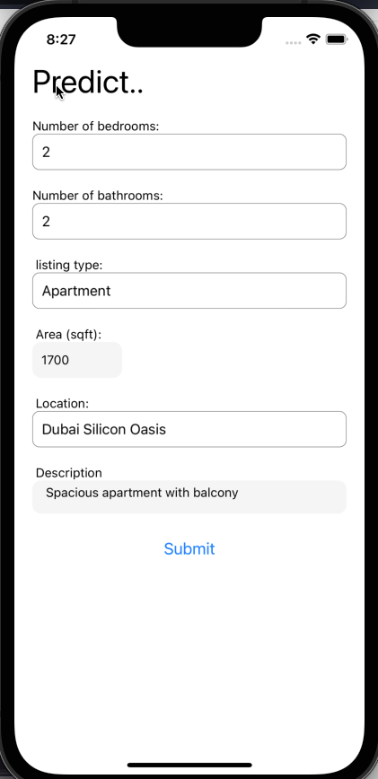
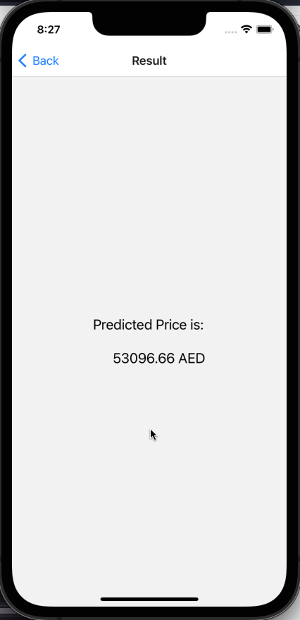

# Real Estate rent price prediction App

App created using react native

### App backend: https://github.com/zeina99/Real-Estate-Price-Prediction-server

# Screenshots

- Main screen where data is input by the user.
- Once submit is clicked, a POST request is sent to the server to obtain the predicted price

- Once the predicted price is recieved as a response, it gets displayed on the screen.

